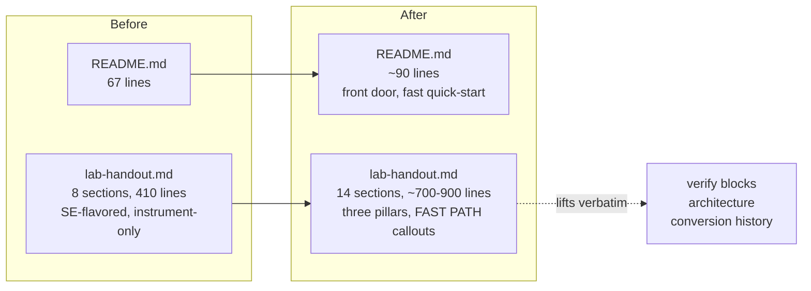

# Sentry Onboarding Lab — Handout & README Rewrite

## Context

The repo is a trainee-ready blank-slate Next.js 16 app for Sentry onboarding.
The current `README.md` (67 lines) and `docs/lab-handout.md` (410 lines) are
written for a developer audience and assume comfort with terminals, git, npm,
Server Components, and Sentry vocabulary (DSN, span, fingerprint).

The actual audience is wider: **Solutions Engineers** through **Customer
Success Managers** and **Account Executives**, some of whom have never opened
a terminal. The lab needs to teach all three pillars — **Instrument** the SDK,
**Configure** Sentry from the UI, **Use** Sentry like a customer — without
losing either end of that audience.

Scope is `README.md` and `docs/lab-handout.md` only. App code, `TODO` markers,
the "no `@sentry/nextjs` in `package.json`" constraint, and the wizard step
all stay as they are.

## Confirmed scope (locked with the user)

- **Screenshots:** placeholders only. Reserve named anchors like
  `[Figure 6.1: First event in Issues list]`; real images are deferred.
- **Length budget:** target ~700–900 lines for `docs/lab-handout.md` (was
  ~410). Full coverage of all three pillars, inline term definitions,
  troubleshooting, and a small terms reference. Not padded; not stripped.
- **README budget:** ~90 lines. GitHub front door — most readers leave for
  the handout within 10 seconds.

## Document shape (before / after)



## Handout section flow (the substance)

```
§1 Welcome + finish line
§2 Three pillars: Instrument / Configure / Use
§3 Prerequisites (editor, Node, Git, terminal, Sentry, GitHub)
§4 Step 1 — Run the app, tour it, no Sentry yet
§5 Step 2 — Wizard, every prompt annotated
§6 Step 3 — First event ✨
§7 Step 4 — Wiring the SDK (the TODO seam)
§8 Step 5 — Per-lab walkthroughs (errors → tracing → logs → seer → feedback → metrics)
§9 Step 6 — Configure Sentry from the UI (NEW)
§10 Step 7 — Use Sentry like a customer (NEW)
§11 End-to-end verification checklist
§12 Troubleshooting + how to ask for help (NEW)
§13 Reference: Terms (~10 inline-defined entries)
§14 Maintainer appendix (architecture + Next 16 traps + conversion history, lifted verbatim)
```

`[FAST PATH]` callouts at §3, §5, §7, §8 let SEs skip the hand-holding.

## Structural decisions

1. **Single linear handout, not two tracks.** A parallel non-tech track
   signals to whichever audience wasn't being addressed that the lab isn't
   for them. Inline definitions + 3–5 `[FAST PATH]` callouts instead.
2. **Customer-scenario framing per lab, but verify blocks lifted verbatim.**
   The current verify text (SPC-ERR-06 vs 07 fingerprint distinction; the
   named Seer call chain) is battle-specific — keep it word-for-word as the
   "Verify in Sentry" subsection. Customer-scenario language wraps it, never
   replaces it.
3. **No glossary section; inline definitions on first use.** Glossaries get
   skipped. Inline definitions don't. Small **Reference: Terms** appendix
   (§13, ~10 entries) for re-lookup only.
4. **"Wiring the SDK" moves to before per-lab walkthroughs.** The current
   "Cross-cutting work" section is dense because it's at the end. Up-front
   placement lets each lab assume the concepts.
5. **Three pillars made explicit.** Add Configure (§9) and Use (§10) — the
   current handout barely covers either.
6. **Architecture section moves to a maintainer appendix.** Maintainer-grade
   detail (in-memory store caveats, `redirect()` throws, Next 16 traps) is
   preserved verbatim but flagged "not for trainees."
7. **Reserve named screenshot anchors** like `[Figure 6.1: First event in
   Issues list]` so screenshots can be added later without restructuring.

## README.md — new shape (~90 lines)

The README is the GitHub front door. Most readers should leave for the
handout within 10 seconds.

```
# Sentry Onboarding Lab

> 1-line orientation: wire Sentry into a Next.js app, configure it from the
> UI, use it like a customer. Trainees → docs/lab-handout.md.

## Quick start (already onboarded?)
   git clone, npm install, npm run dev, npx @sentry/wizard@latest -i nextjs

## Who this lab is for
   SEs, CSMs, AEs, anyone learning Sentry hands-on, technical or not.

## What you'll do
   Three pillars, one paragraph. Instrument, configure, use.

## What's in the box
   Demo flow at /, /products, /cart, /signin, /dashboard.
   Six labs at /labs/{errors,tracing,logs,seer,feedback,metrics}.
   ~22 specimens; every place the SDK plugs in is marked TODO.

## Surfaces (table — preserved from current README)
## API endpoints (table — preserved)
## Stack (preserved)
## Where to start
   1. docs/lab-handout.md
   2. rg -n "TODO" .
   3. Skim CLAUDE.md / AGENTS.md for Next 16 conventions
```

## Per-lab template (§8)

Every lab uses the same six-block shape:

```
### /labs/<name>

Customer scenario       1–2 sentences, real-world story
What you see in the app specimen IDs + what TRIGGER buttons do
What you change in code TODO list for this lab, with file paths
Verify in Sentry        LIFTED VERBATIM from current handout
What you learned        1–2 lines
[Figure 8.X: ...]       reserved screenshot anchor
```

## §9 — Configure Sentry from the UI (new content)

- Projects, teams, environments — what each is, which to use for the lab.
- Connect GitHub (Settings → Integrations → GitHub). Required for Seer.
- Connect Slack (optional, realistic).
- Write one alert rule: any new issue → email me.
- Sampling: `tracesSampleRate: 1.0` for the lab; pointer to `tracesSampler`.
- DSNs and environments — one paragraph; what the wizard set.

## §10 — Use Sentry like a customer (new content)

Five ~5-minute exercises:

- Triage SPC-ERR-04 server-action issue (breadcrumbs, stack, tags, resolve).
- Walk a `/labs/tracing` SPC-TRC-01 trace (three nested `/api/echo` spans).
- Watch a Replay of the demo flow (password masked on `/signin`).
- Run Seer on the `/labs/seer` issue (named chain `parseOrder →
  validateLineItem → priceOf → applyDiscount`).
- Submit a User Feedback widget entry; confirm it lands.

## §12 — Troubleshooting (new)

Common stuck points: `node -v` mismatch, missing
`.env.sentry-build-plugin` token, no event arriving (sampling, project
mismatch, Server Action without `Sentry.withServerActionInstrumentation`),
TS errors after wizard (restart dev server). Plus an explicit "how to ask
for help" script for non-tech learners: paste the step, terminal output,
screenshot, Sentry org slug.

## Files modified

- `README.md`
- `docs/lab-handout.md`

## Files to read while writing (verbatim lifts)

- `docs/lab-handout.md` — current verify blocks (§4 per-lab), architecture
  (§7), conversion-history appendix.
- `CLAUDE.md` — TODO seam table is the source of truth for §7 wiring.
- `app/labs/*/page.tsx` — exact specimen IDs and trigger labels for §8.
- `instrumentation.ts`, `app/global-error.tsx`, `next.config.ts`,
  `lib/metrics.ts`, `app/components/lab-trigger.tsx`,
  `app/labs/seer/actions.ts`, `app/labs/tracing/page.tsx`,
  `app/labs/logs/actions.ts`, `app/labs/metrics/{page,actions}.ts` — exact
  TODO comment text for the §7 wiring table.

## Constraints respected

- `@sentry/nextjs` stays out of `package.json`.
- No new docs files. Only `README.md` and `docs/lab-handout.md` change.
- App code, TODO markers, specimens, lab UIs untouched.
- Lab-notebook UI aesthetic (SPC-* IDs, uppercase labels) preserved in
  references; documentation copy itself stays plain so it scans.
- Inline-defined terms appear *before* the term is used in code or
  instructions, never after.
- The conversion-history appendix is preserved verbatim.
- TODO seam is referenced, not enumerated by count: tell readers to run
  `rg -n "TODO" .` rather than committing to a number that drifts.

## Execution order

1. **Read the verbatim-lift sources first** (current `docs/lab-handout.md`
   verify blocks, architecture, conversion-history appendix; specimen IDs in
   `app/labs/*/page.tsx`; current TODO comment text in
   `instrumentation.ts`, `app/global-error.tsx`, `next.config.ts`,
   `lib/metrics.ts`, `app/components/lab-trigger.tsx`,
   `app/labs/seer/actions.ts`, `app/labs/tracing/page.tsx`,
   `app/labs/logs/actions.ts`, `app/labs/metrics/{page,actions}.ts`).
2. **Rewrite `README.md` first.** It's the smaller artifact and sets the
   tone — once it's right, the handout's voice falls in line.
3. **Rewrite `docs/lab-handout.md`** in the §1–§14 order documented above.
   Lift verify blocks and the maintainer appendix verbatim; write fresh
   prose for §1, §2, §3, §6, §9, §10, §12, §13.
4. **Run `rg -n "TODO" .`** during §7 drafting to confirm the wiring table
   matches the actual TODO seam (no drift, no missing files).
5. **Run `npm run lint` and `npm run build`** at the end to confirm no app
   code drifted (markdown-only changes shouldn't break either).

## Verification

After execution:

1. **Non-tech skim test:** read the new handout start-to-finish. Every term
   used in step N is either common English or defined inline before step N.
2. **SE skim test:** the FAST PATH callouts let you skip §3 → §5 → §7 → §8
   → end. Every command is paste-ready.
3. **Lab coverage:** every lab in the surfaces table has a §8 walkthrough;
   every TODO marker (`rg -n "TODO" .`) is referenced in §7 or §8.
4. **Specimen ID consistency:** spot-check that `SPC-ERR-01..07`,
   `SPC-TRC-01..04`, `SPC-LOG-01..03`, `SPC-MET-01..05` etc. match the lab
   pages.
5. **Three-pillar coverage:** §7 covers Instrument, §9 Configure, §10 Use.
6. **`npm run lint` and `npm run build` pass** — markdown-only changes
   shouldn't affect either, but verify nothing in app code drifted.
7. **Maintainer appendix preserves verbatim** the "what was deleted to make
   this a blank slate" content from the current handout's Appendix.

## Not in scope (deferred)

- Real screenshots — placeholders only this pass.
- Any change to lab pages, specimens, or `LabSpecimen` components.
- Re-adding `@sentry/nextjs` or any `sentry.*.config.ts` file.
- A `docs/lab-rewrite-plan.md` companion — the plan lives in this file
  only; the constraint is "no new docs files."